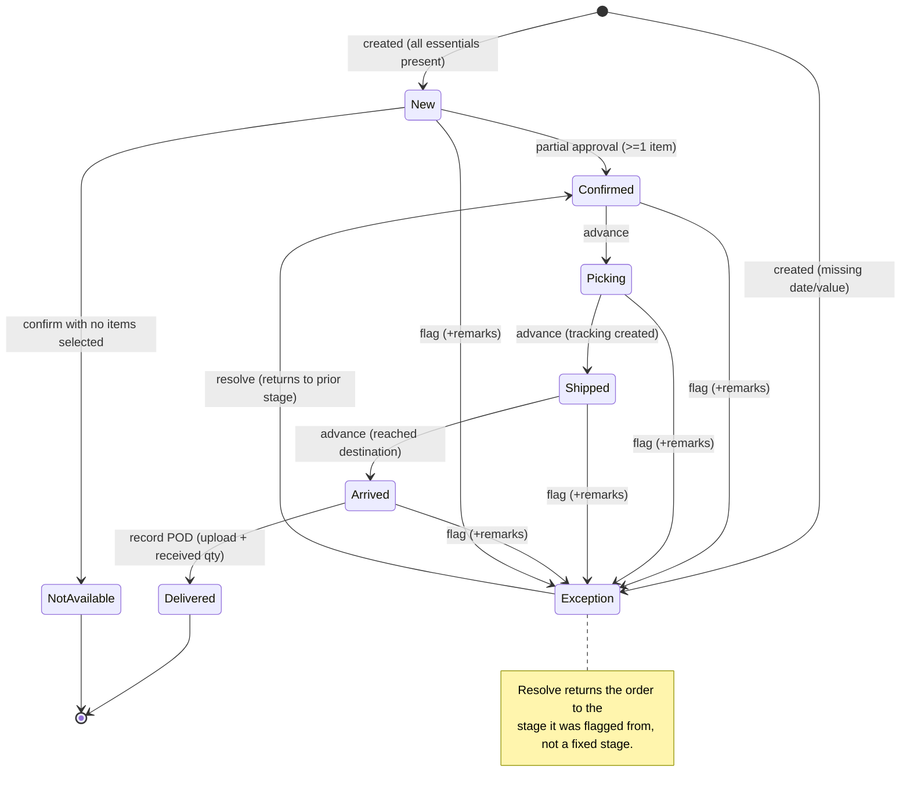
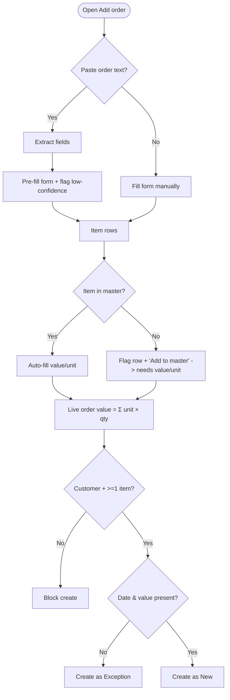
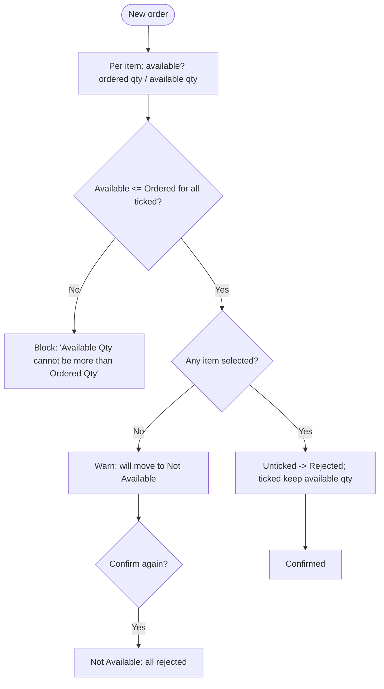
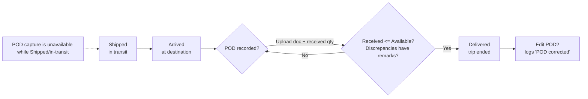
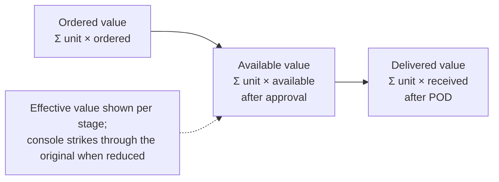

# Process Flows — Cargoflow OMS

Mermaid diagrams (render natively on GitHub).

## 1. Order lifecycle state machine

## 2. Add order — form + optional AI extract

## 3. Partial approval (New order)

## 4. Shipping → arrival → delivery (POD gated)

## 5. Value tracking across stages

## Notes
- The **Arrived** stage exists specifically so proof of delivery is only capturable once the shipment has physically reached the destination (Flow 4).
- **Exception** is reachable from every active stage and always returns to the stage it came from (Flow 1), so flagging never loses an order's place.
- Prices are snapshotted at creation; value then only *narrows* through approval and delivery (Flow 5).
