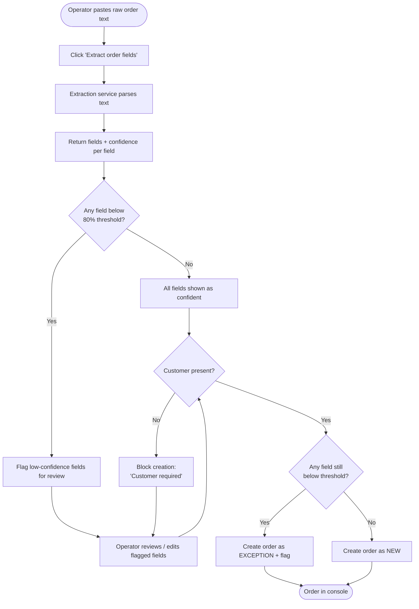
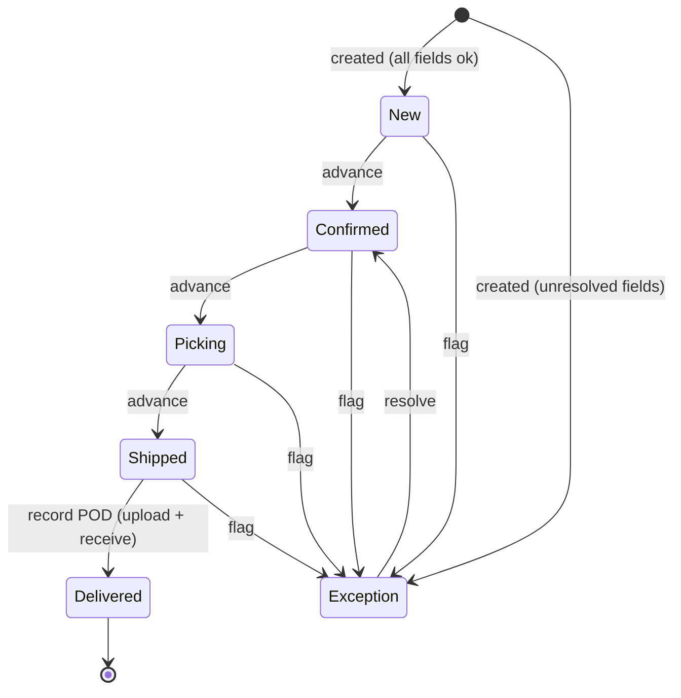
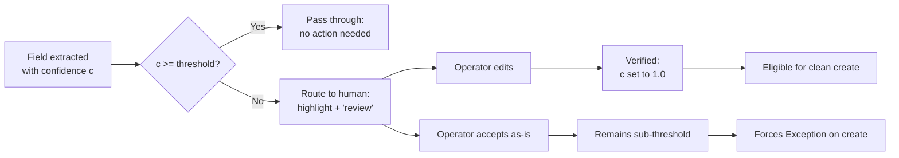
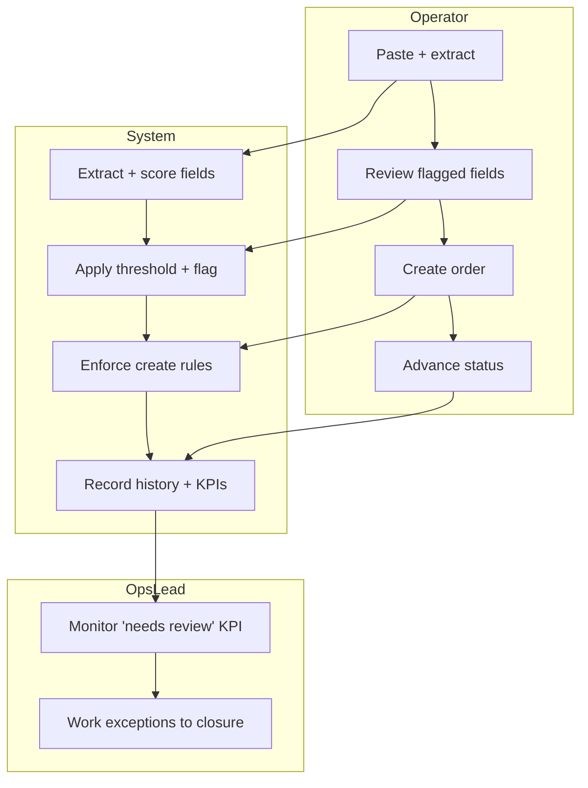

# Process Flows — Cargoflow OMS

Diagrams use Mermaid, which renders natively on GitHub.

## 1. AI-assisted intake (happy path + review loop)

## 2. Order lifecycle state machine

## 3. Confidence-threshold decision (the core control)

## 4. Roles & ownership (swimlane view)

## Notes on the design
- The **threshold decision (Flow 3)** is the heart of the product: it's where AI speed and human accountability meet. Documented as a configurable business rule (BR-1) so operations can tune the speed/quality trade-off.
- The lifecycle (**Flow 2**) keeps `Exception` reachable from every active state, because problems can surface at any point, and always recoverable via `resolve`.
